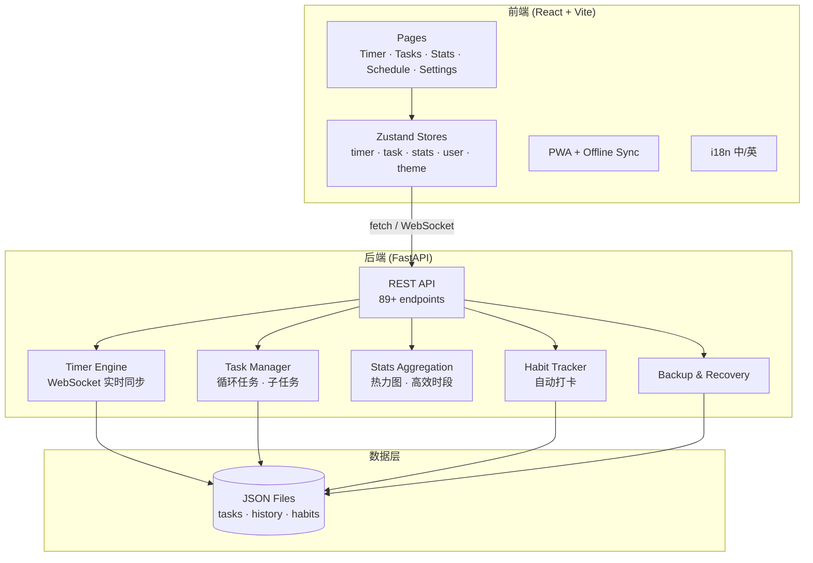

# PolarClock — 番茄钟时间管理系统

> 全功能番茄钟 + 任务管理 + 健康习惯追踪，React + FastAPI 全栈 PWA 应用。

## 架构概览



## 功能特性

| 模块 | 功能 |
|------|------|
| 🍅 **番茄钟** | 45min 工作 + 10min 休息，长休息，运动计时（拳击/跑步），冥想模式，翻页时钟动画 |
| 📋 **任务管理** | 无限嵌套子任务，甘特图，标签过滤，二象限优先级推荐，循环任务（日/周/月），番茄进度追踪 |
| 📊 **统计分析** | 今日/周/月统计，GitHub 风格热力图，高效时段分析，任务完成率，分享卡片导出 |
| 🍽️ **日程管理** | 三餐提醒，课程/Block 管理，周视图 |
| 🎵 **环境音** | Web Audio API 生成 5 种白噪音预设（雨声、咖啡馆、海浪、壁炉、微风），音量控制 |
| 💪 **习惯追踪** | 自定义习惯，番茄钟/运动/冥想完成时自动打卡 |
| 💾 **数据备份** | 创建/恢复备份，差异对比预览，恢复前自动安全备份 |
| 🌐 **PWA** | 离线缓存，安装提示，离线请求队列，网络恢复自动同步 |
| 🌍 **国际化** | 中文/英文切换，语言偏好持久化 |
| 🎨 **主题** | 亮色/暗色模式，CSS 变量全局切换 |

## 快速开始

### 本地开发

**后端：**

```bash
cd backend
pip install -r requirements.txt
python main.py
# API: http://localhost:15550
# Swagger: http://localhost:15550/docs
```

**前端：**

```bash
cd frontend
npm install
npm run dev
# App: http://localhost:4555/clock/login
```

输入用户名即可登录（无需密码）。

### Docker 部署

```bash
# 构建并启动
docker compose up -d

# 或手动构建
docker build -t polarclock-backend ./backend
docker build -t polarclock-frontend ./frontend
docker run -d -p 15550:15550 polarclock-backend
docker run -d -p 4555:4555 polarclock-frontend
```

### Tailscale Funnel 部署

```bash
./scripts/deploy.sh
tailscale funnel 443
```

## 技术栈

| 层 | 技术 |
|----|------|
| 前端 | React 18 · Vite 5 · TailwindCSS · Zustand · react-i18next · html2canvas · Web Audio API |
| 后端 | FastAPI · Pydantic · WebSocket · Python 3.9+ |
| 测试 | Vitest + Testing Library（前端 25 tests） · pytest（后端 50 tests） |
| PWA | vite-plugin-pwa · Workbox · Service Worker |
| 数据 | JSON 文件存储 · localStorage 离线缓存 |

## 项目结构

```
Clock/
├── backend/
│   ├── main.py              # FastAPI 入口，89+ API 端点
│   ├── routers/
│   │   ├── timer.py         # 计时器引擎 + WebSocket
│   │   ├── tasks.py         # 任务 CRUD + 循环任务
│   │   ├── stats.py         # 统计聚合 + 热力图 + 高效时段
│   │   ├── schedule.py      # 日程管理
│   │   ├── habits.py        # 习惯追踪 + 自动打卡
│   │   ├── history.py       # 番茄历史记录
│   │   ├── backup.py        # 数据备份与恢复
│   │   ├── users.py         # 用户认证
│   │   └── devmode.py       # 开发调试
│   ├── data/                # 用户数据 (JSON)
│   └── requirements.txt
├── frontend/
│   ├── src/
│   │   ├── pages/           # Timer · Tasks · Stats · Schedule · Settings
│   │   ├── components/      # FlipClock · GanttChart · ShareCard · AmbientSound...
│   │   ├── stores/          # Zustand: timer · task · stats · user · theme...
│   │   ├── utils/           # ambientSound · offlineSync · sounds
│   │   ├── i18n/            # 中英翻译文件
│   │   └── test/            # Vitest 组件测试
│   ├── vite.config.ts       # PWA + 代码分割
│   └── package.json
└── SSOT/                    # 架构决策文档
```

## 快捷键

| 按键 | 功能 |
|------|------|
| `←` `→` | 切换页面 |
| 点击计时器 | 开始/暂停 |

## API 文档

启动后端后访问自动生成的 Swagger UI：

- **Swagger**: http://localhost:15550/docs
- **ReDoc**: http://localhost:15550/redoc

覆盖 9 个 API 模块、89+ 端点，包含完整的 schema 和描述。

## 测试

```bash
# 后端测试
cd backend && pytest -v

# 前端测试
cd frontend && npm test
```

## License

MIT
