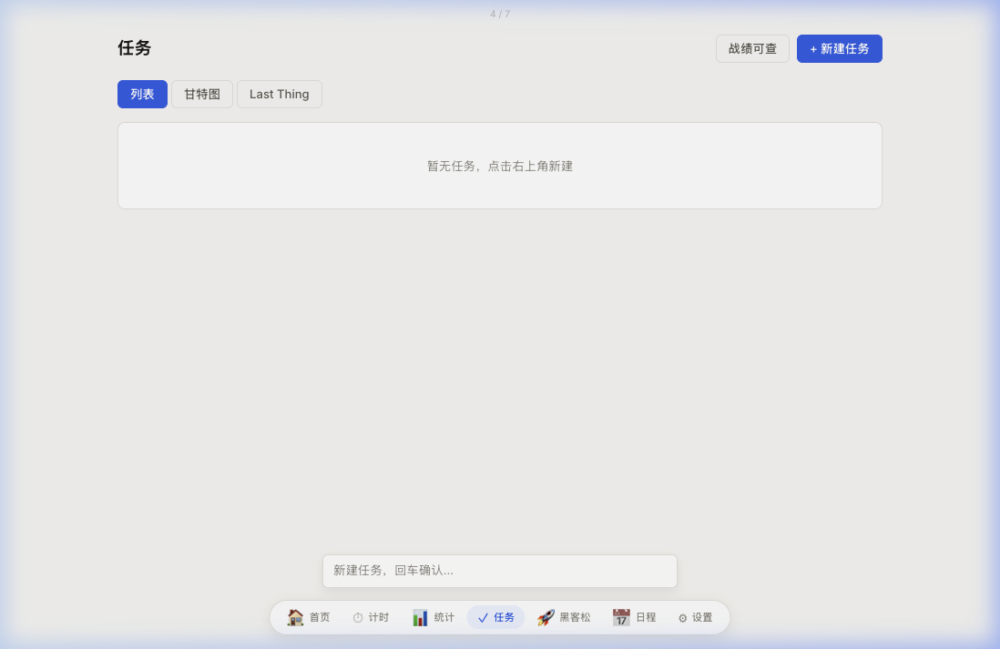
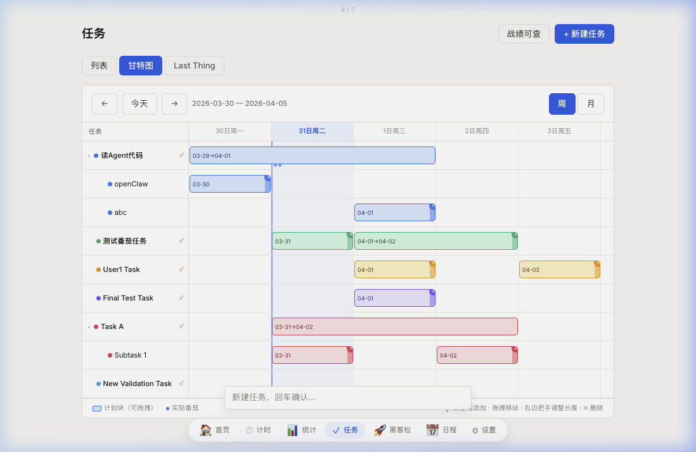
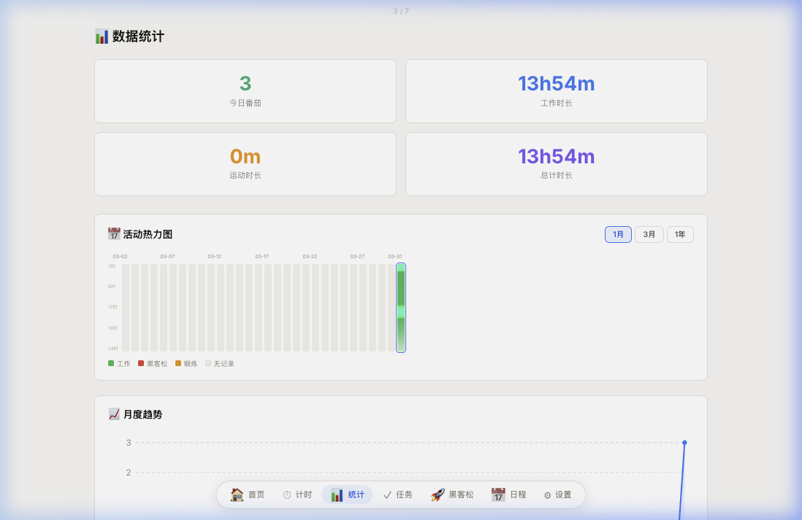
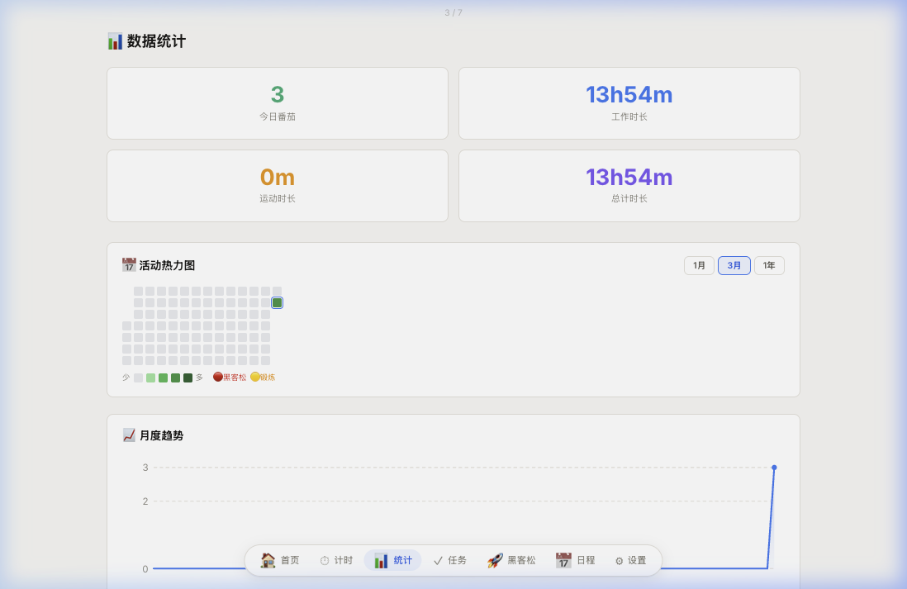
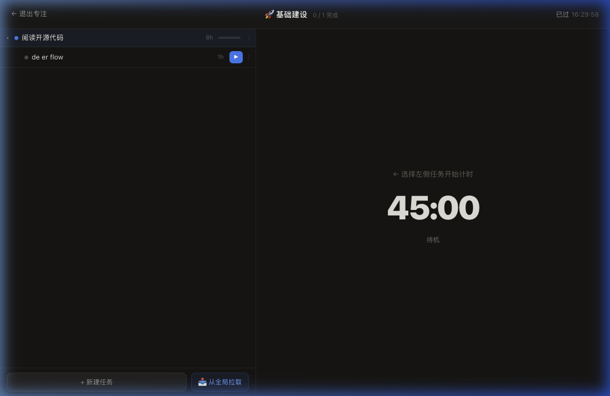

# PolarClock 用户使用手册

> 面向第一次使用该网站的普通用户，无需了解任何技术背景。

---

## 这个网站是做什么的？

**PolarClock** 是一个个人生产力系统，帮助你：

- **用番茄钟专注工作** — 把精力集中在一件事上，记录工作时长
- **管理任务列表** — 记录有哪些事要做，跟踪做了多少
- **用甘特图规划时间** — 在日历上安排每件事的起止时间
- **查看客观数据** — 热力图直观看到每天的工作节奏
- **管理黑客松冲刺** — 专注模式全屏工作台，冲刺阶段性目标
- **管理固定日程块** — 记录上课、会议等每周固定的时间段
- **智能吃饭提醒** — 到饭点自动响铃，可一键启动 60 分钟吃饭倒计时

---

## 如何访问

在浏览器中打开：

```
http://localhost:4555/clock
```

首次打开会自动跳转到登录页。输入用户名后点击「进入时钟」。

> **无需密码**，直接输入用户名即可登录。

> 如果页面空白或出现"无效的 token"，说明登录状态已过期，刷新页面重新登录即可。

---

## 界面导航

登录后，底部导航栏有 7 个页面：

| 图标 | 名称 | 用途 |
|------|------|------|
| 🏠 | 首页 | 全局概览，当前状态一览 |
| ⏱ | 计时 | 番茄钟计时器 |
| 📊 | 统计 | 查看工作数据和热力图 |
| ✓ | 任务 | 管理任务和子任务（含甘特图和 Last Thing） |
| 🚀 | 黑客松 | 管理冲刺项目，进入全屏专注模式 |
| 📅 | 日程 | 管理固定时间块和吃饭时间 |
| ⚙ | 设置 | 修改计时参数 |

### 键盘导航

在桌面端，可用 **← →** 方向键在页面间切换。在「任务」页内，方向键在三个子视图（列表 → 甘特图 → Last Thing）之间切换，到达边界再跳至相邻页面。

完整导航链：
```
统计 ←→ 任务[列表] ←→ 任务[甘特图] ←→ 任务[Last Thing] ←→ 黑客松
```

---

## 功能使用方法

### 1. 番茄钟

**开始一个番茄钟：**
1. 点击底部「计时」
2. （可选）点击顶部「未绑定任务·点击选择」，绑定当前正在做的任务
3. 点击「开始」，进入 45 分钟工作倒计时
4. 专注工作，计时结束后点击「完成」

**暂停 / 继续：** 工作中可随时点「暂停」，之后点「继续」恢复。

**中途停止：** 点「停止」结束 — 如果已工作超过 5 分钟，这段时间也会自动计入统计。

**休息提示：** 番茄结束后，系统会自动提示下一步是短休息、娱乐休息还是运动时间，按提示操作即可。

> 顶部显示当前绑定的任务（点击可切换），右下方提供「停止」和「暂停」按钮。

---

### 2. 任务管理

**创建任务：**
1. 点击底部「任务」
2. 在页面底部输入框里直接输入任务名称，回车确认
3. 也可点击右上角「+ 新建任务」按钮

**查看详情：** 点击任意任务名称，进入详情页，可查看进度、甘特图，也可以添加子任务。

**添加子任务：** 在任务详情页底部「子任务」区域输入名称后回车或点「添加」。

**标记完成：** 详情页点击「标记完成」，该任务自动归档，从主列表消失。

**三视图切换：** 页面顶部可切换三个视图：

| 视图 | 用途 |
|------|------|
| 列表 | 查看所有任务，快速增删 |
| 甘特图 | 在日历上安排任务起止时间 |
| Last Thing | 重要×想做象限矩阵，帮你快速决定下一步做什么 |

> 父任务（有子任务的任务）不支持在甘特图中直接添加时间块，请对最底层的子任务操作。



甘特图视图（右键切换）：



---

### 3. 甘特图

甘特图在两处可用：**任务列表页 → 「甘特图」视图**，以及**每个任务详情页**。

| 操作 | 方法 |
|------|------|
| 添加时间块 | 点击任意空白日期格 |
| 移动时间块 | 长按拖动 |
| 调整时长 | 拖动右侧把手 |
| 删除时间块 | 悬停后点击「✕」 |
| 切换视图 | 右上角「周」/「月」按钮 |

> 蓝色方块 = 计划块（可拖拽），橙点 = 实际番茄记录。

---

### 4. 数据统计与热力图

点击底部「统计」，可以看到：

- **今日数据**：番茄数、工作时长、运动时长、总计时长
- **热力图**：直观展示过去的工作节奏（支持三种范围）
- **月度趋势**：折线图展示每天番茄完成情况
- **今日记录**：每条记录带时间戳

#### 热力图范围切换

点击热力图右上角的范围选择器：

| 范围 | 显示方式 |
|------|---------|
| **1个月（默认）** | 竖向灯带视图（每天一根灯带，精确到每小时） |
| **3个月** | GitHub 方格热力图（每天一格） |
| **1年** | GitHub 方格热力图（紧凑版） |

#### 灯带视图说明

每根竖向灯带代表一天（从上到下 = 0:00 到 24:00）：

| 颜色 | 含义 |
|------|------|
| 🟢 绿色 | 工作番茄（专注工作时段） |
| 🔴 红色 | 黑客松番茄（冲刺模式中完成的番茄） |
| 🟡 黄色 | 锻炼番茄（运动时段） |
| 白/浅灰 | 无记录时段 |

颜色会以柔和的渐变扩散（巴特沃斯低通滤波效果），让相邻时段之间有自然过渡。

**1个月灯带视图**（默认）：每条竖向灯带 = 一天，绿色高亮今日有番茄的时段



**3个月 GitHub 方格视图**：



---

### 5. 黑客松

#### 普通模式（项目管理）

**新建冲刺：**
1. 点击「黑客松」→「+ 新建冲刺」
2. 输入冲刺名称，选择总时长（如 12h）→ 点「下一步」
3. 从全局任务列表中勾选要纳入的任务 → 点「下一步」
4. 为每项任务分配预计工时（小时）→ 点「🚀 开始冲刺！」

**添加子任务：** 每个任务右侧点击「+ 子任务」，可无限层级展开。

**开始计时：** 找到最底层（叶子）任务，点击「▶ 开始」进入全屏计时。

#### 专注模式（全屏工作台）⚡

点击任意项目卡片上的「**⚡ 进入专注模式**」，进入全屏工作台。

专注模式会覆盖整个屏幕（包括导航栏），提供：
- **左侧**：精简任务树，显示当前冲刺的所有任务
- **右侧**：计时器，点击任意叶子任务的「▶ 开始」进入倒计时
- **顶部**：已用时间、项目名、退出按钮

**在专注模式内操作任务：**

| 操作 | 效果 |
|------|------|
| 新建任务 | 同时在全局任务中创建（自动同步） |
| 新建子任务 | 同时在全局任务中创建对应子任务 |
| 删除任务 | 在黑客松内删除，**同时删除全局任务** |
| 踢出任务 | 从黑客松内移除，全局任务**保留不删** |
| 从全局拉取 | 「📥 从全局拉取」按钮，从全局任务列表添加任务到当前冲刺 |

> 在专注模式内完成的番茄会在统计热力图中显示为**红色**（区别于普通工作的绿色）。

**退出专注模式：** 点击顶部「← 退出专注」，回到普通 App 界面，所有状态保留。



---

### 6. 吃饭提醒

系统会自动在吃饭前后向你发出提醒，无需手动操作：

| 时间点 | 提醒方式 |
|--------|---------|
| 吃饭前 30 分钟 | 🔔 响铃 + 右上角横幅提示「快去点外卖！」 |
| 到吃饭时间 | 🔔 响铃 + 全屏弹窗 |
| 点击开始计时 | 启动 60 分钟吃饭倒计时，结束再次响铃 |

> 如需修改三餐时间，在「日程」页面的「吃饭时间」区域调整。

---

### 7. 日程管理

**添加固定时间块：**
1. 点击「日程」
2. 在周视图中，在某天的某个时间段**拖动鼠标**选取时段
3. 输入名称，点击「确认」

添加后，该 Block **每周自动重复**。

**修改：** 拖动 Block 调整位置或拖拽边缘调整时长。修改只影响本周及之后，不会改变已过去的周。

**删除：** 鼠标悬停在 Block 上，点击「✕」。

> 底部「所有周期规则」显示已设定的所有循环 Block。

---

### 8. 设置

点击底部「设置」可修改所有计时参数：

| 选项 | 说明 | 默认值 |
|------|------|--------|
| 工作时长 | 每个番茄钟的工作时间 | 45 分钟 |
| 短休息时长 | 番茄间短休息 | 5 分钟 |
| 长休息时长 | 连续4个番茄后的长休息 | 15 分钟 |
| 休闲时间 | 每2个番茄后的娱乐时间 | 15 分钟 |
| 连续番茄数后提醒运动 | N 个番茄后提示运动 | 4 个 |

页面底部有「退出登录」按钮。

---

## 常见操作流程

### 每天开始工作

1. 进入「任务」→「Last Thing」视图，查看重要×想做排名
2. 点击推荐的任务 → 进入详情 → 「🍅 开始番茄钟」
3. 专注 45 分钟，完成后按提示短暂休息
4. 循环往复

### 查看今天的成果

1. 进入「统计」页
2. 查看「今日番茄数」和「工作时长」
3. 灯带热力图直观显示今天哪些时段在工作

### 进行集中冲刺（黑客松）

1. 在「黑客松」新建冲刺，设定时限和任务
2. 点击「⚡ 进入专注模式」，进入全屏工作台
3. 选择第一个任务，点「▶ 开始」，专注工作
4. 任务完成后标记完成，切换到下一个任务
5. 退出专注模式，在统计页查看本次冲刺的红色番茄记录

---

## 常见问题

| 问题 | 解决方法 |
|------|---------|
| 页面空白 / 跳到登录页 | 刷新后重新登录 |
| 番茄数据没计入统计 | 确认工作时间 ≥ 5 分钟；刷新统计页 |
| 甘特图点击没反应 | 该任务是父任务，请对底层子任务操作 |
| 日程 Block 消失 | 检查网络连接；重新打开日程页确认 |
| 统计数据不更新 | 刷新页面，数据从服务器实时读取 |
| 黑客松倒计时不对 | 确认已点击「▶ 开始」而非仅打开工作区 |
| 登录页要密码 | 无需密码，直接输入用户名点「进入时钟」即可 |
| 吃饭提醒没响 | 检查浏览器是否允许该页面播放声音；确认「日程」里三餐时间已设置 |
| 方向键切换任务视图无效 | 确认当前焦点不在输入框内，点击页面空白区域后再按方向键 |

---

*PolarClock — 把时间真正用在该用的地方。*
