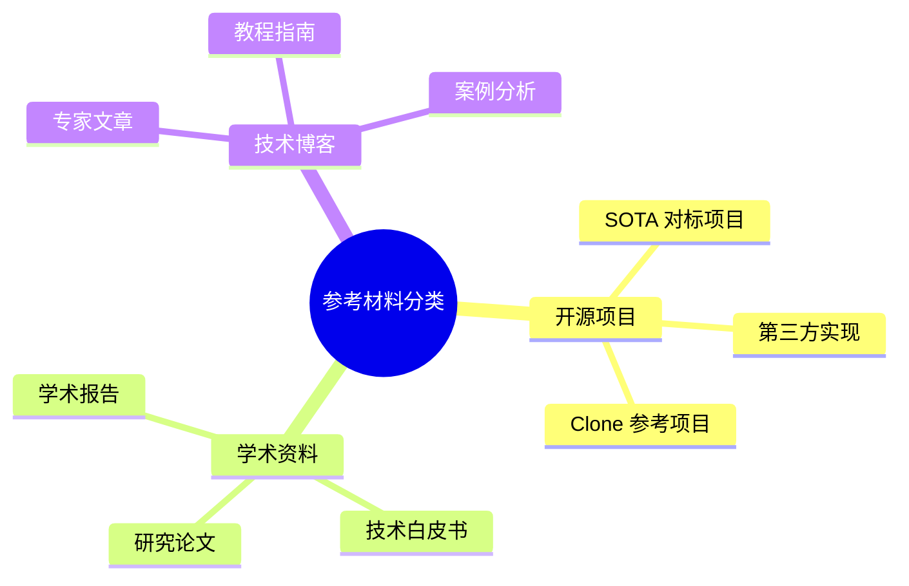

## 定义

参考材料分类（Reference Material Categorization）是一种系统化的知识管理方法，指在项目或组织内部，按照预定义的标准对外部参考资料进行分组、归类和有序存储的管理实践。

从信息科学的视角来看，分类是组织信息的基本手段之一。在软件开发项目中，参考资料通常来源于多种渠道、具有不同的形态和用途。通过建立统一的分类体系，可以将这些分散的知识资产整合为结构化的信息资源池。

参考材料分类的核心在于**分类标准的确定**与**分类结果的持续维护**。有效的分类不仅需要考虑资料本身的特征，还需要兼顾使用者的检索习惯和项目的实际需求。

## 解决什么问题

在软件开发过程中，团队会积累大量的外部参考资料，包括技术文档、开源代码、学术论文、行业报告等。缺乏分类管理的参考资料库会面临以下核心问题：

### 信息冗余与重复

当参考资料缺乏统一的组织方式时，开发者可能下载或保存多份内容相似但版本不同的资料，导致存储空间浪费，同时也增加了资料更新的难度。

### 检索效率低下

在紧急开发场景中，需要快速定位某项技术的参考资料时，如果资料存储混乱，搜索过程将耗费大量时间，影响开发效率。

### 知识传承断层

项目成员更替时，新成员难以快速了解项目技术栈的全貌和参考资料的位置，知识无法有效传递，项目持续维护成本增加。

### 版本管理混乱

参考资料可能存在多个版本，缺乏分类管理会导致使用过时版本或无法确认当前使用的资料是否为最新版本。

## 工作原理

### 分类体系构建

参考材料分类首先需要建立一套合理的分类体系。典型的分类维度包括：

```
参考材料分类体系
│
├── 按来源类型
│   ├── 开源项目
│   ├── 学术论文
│   └── 技术博客
│
├── 按技术领域
│   ├── 前端技术
│   ├── 后端架构
│   ├── 算法优化
│   └── 基础设施
│
├── 按应用场景
│   ├── 功能实现参考
│   ├── 架构设计对标
│   └── 最佳实践学习
│
└── 按资料形式
    ├── 文档类
    ├── 代码类
    └── 多媒体类
```

### 分类执行流程

参考材料分类的标准执行流程如下：

```
┌─────────────────────────────────────────────────────────────┐
│                      分类执行流程                            │
├─────────────────────────────────────────────────────────────┤
│                                                             │
│   ┌──────────┐    ┌──────────┐    ┌──────────┐             │
│   │ 资料获取 │ -> │ 类型识别 │ -> │ 分类存储 │             │
│   └──────────┘    └──────────┘    └──────────┘             │
│        │                               │                    │
│        v                               v                    │
│   ┌──────────┐                  ┌──────────┐               │
│   │ 来源标注 │                  │ 元数据登记│               │
│   └──────────┘                  └──────────┘               │
│                                                             │
└─────────────────────────────────────────────────────────────┘
```

1. **资料获取**：从外部渠道收集有价值的参考资料
2. **类型识别**：判断资料属于哪种类型（开源项目/论文/博客）
3. **分类存储**：将资料放入对应的分类目录下
4. **来源标注**：记录资料的原始出处和获取时间
5. **元数据登记**：建立索引便于后续检索

### 分类与标签的协同

在实际应用中，分类与标签（Tagging）通常协同使用：

| 维度 | 分类 | 标签 |
|-----|------|------|
| 层级关系 | 有严格的层级结构 | 扁平化，可自由组合 |
| 数量限制 | 每个资料通常属于一个类别 | 可添加多个标签 |
| 灵活性 | 相对固定 | 高度灵活 |
| 适用场景 | 结构性整理 | 快速标记和检索 |

## 关键公式/方法

### 分类完整性评估

参考材料分类的完整性可通过以下指标评估：

**分类覆盖率** = 已分类资料数量 ÷ 资料总数 × 100%

```
分类覆盖率 = (N_classified / N_total) × 100%

其中：
- N_classified: 已完成分类的资料数量
- N_total: 参考资料总数量
```

**检索效率提升** = (分类前平均检索时间 - 分类后平均检索时间) ÷ 分类前平均检索时间 × 100%

### 分类目录深度控制

为保证分类体系的可用性，建议控制目录层级深度：

```
建议最大层级深度 = ⌊log₂(N)⌋ + 1

其中：
- N: 参考资料总数
- ⌊ ⌋: 向下取整运算
```

例如，当参考资料总数为 100 时，建议的最大层级深度为 ⌊log₂(100)⌋ + 1 = 6 + 1 = 7 层。实际应用中，建议保持 3 层以内的目录结构以确保可维护性。

## 典型应用

### 应用场景：Clone 项目的参考目录管理

Clone 项目采用参考材料分类方法管理 `reference/` 目录下的外部资料，具体应用如下：

**场景描述**：

Clone 项目需要参考和对比业界优秀的开源实现、学术研究成果以及技术博客经验。为有效管理这些资料，项目建立了分类清晰的 reference/ 目录结构。

**分类实施**：

```
reference/
├── 开源项目/
│   ├── clone-impl-alpha/
│   ├── clone-framework-beta/
│   └── 参考项目说明.md
│
├── 论文/
│   ├── attention-is-all-you-need.pdf
│   ├── chain-of-thought-prompting.pdf
│   └── papers-index.md
│
└── 技术博客/
    ├── agent-architecture-guide.md
    └── 技术文章摘录.md
```

**应用效果**：

- 开发者可快速定位所需类型的参考资料
- 新成员能够系统性地了解项目技术渊源
- 大文件通过 Git LFS 或链接方式妥善管理

### 应用场景：企业技术知识库

在大型技术团队中，参考材料分类可与知识库系统结合：

```
技术知识库
│
├── 开发规范/
│   ├── 代码风格指南
│   └── API 设计规范
│
├── 技术选型/
│   ├── 框架对比分析
│   └── 性能测试报告
│
└── 学习资源/
    ├── 新人引导教程
    └── 进阶学习路径
```

## 与其他概念的对比

### 参考材料分类 vs 标签化管理

| 对比维度 | 参考材料分类 | 标签化管理 |
|---------|--------------|------------|
| 组织方式 | 层级目录结构 | 平面标签网络 |
| 适用规模 | 中小规模（<1000条） | 大规模（>1000条） |
| 维护成本 | 需定期整理目录 | 标签可渐进添加 |
| 准确性 | 单一归属，明确性高 | 多标签组合，灵活度高 |
| 检索方式 | 按目录浏览 | 按标签聚合检索 |

### 参考材料分类 vs 版本控制

| 对比维度 | 参考材料分类 | 版本控制 |
|---------|--------------|----------|
| 核心功能 | 资料的组织和归类 | 资料的变更追踪 |
| 关注点 | 空间维度（存储位置） | 时间维度（历史变更） |
| 工具支持 | 目录结构、文件组织 | Git、SVN 等 |
| 应用阶段 | 资料入库时 | 资料整个生命周期 |

两者相辅相成：分类解决"资料放在哪里"的问题，版本控制解决"资料如何变化"的问题。

## 常见误区

### 过度分类

**误区描述**：建立过于细粒度的分类体系，每个类别下仅有少量资料。

**问题分析**：
- 增加了资料定位的认知负担
- 分类目录层级过深，检索效率反而下降
- 维护成本显著增加

**正确做法**：保持 3 层以内的目录结构，每个类别下至少应有 3-5 项资料。

### 分类标准不统一

**误区描述**：同一目录下混合存放不同类型的资料，或同一类型的资料分散在多个目录下。

**问题分析**：
- 违背了分类的基本原则
- 造成资料定位的混乱
- 影响团队协作效率

**正确做法**：建立统一的分类标准，并在团队内达成共识，必要时编写分类规范文档。

### 忽视资料质量筛选

**误区描述**：对所有参考资料进行无差别存储，导致低质量或重复资料占用空间。

**问题分析**：
- 资料库臃肿，检索噪音增加
- 误导后续学习和开发
- 存储资源浪费

**正确做法**：建立资料准入标准，定期进行资料审计和清理。

### 忽略元数据维护

**误区描述**：只存储资料文件，不记录来源、时间、作者等元数据。

**问题分析**：
- 无法追溯资料原始出处
- 难以判断资料的时效性
- 增加了资料引用的困难

**正确做法**：为每份参考资料建立元数据档案，包括来源 URL、获取日期、作者/机构、版本号等信息。

## 关联知识

### 父级概念

- [[concept-reference-management]] - 只读参考资料管理：参考材料分类的上级概念，定义了资料管理的基本框架和原则

### 相关概念

- [[entity-reference-dir]] - reference/ 目录：参考材料分类的具体实施载体
- [[entity-git-lfs]] - Git LFS：处理分类后大体量参考文件的存储技术

### 扩展知识

- **知识图谱**：更高级的知识组织方式，通过实体关系网络实现知识的语义关联
- **元数据管理**：支撑参考材料分类的基础技术，确保资料的可发现性和可追溯性

## 待探讨

以下问题值得进一步思考和讨论：

1. **自动化分类**：随着资料数量增长，是否需要引入基于机器学习的自动分类工具？

2. **动态分类**：当某项技术的分类边界模糊时（如一项技术既是论文也是开源项目），如何处理？

3. **分类与搜索的平衡**：在建立分类体系的同时，是否需要同步考虑全文搜索能力的建设？

4. **跨项目分类**：多个相关项目之间是否需要建立统一的分类标准以实现知识共享？

5. **资料生命周期**：参考资料是否有有效期？如何建立资料的定期评审和淘汰机制？

## 来源

本概念页内容基于 Clone 项目 `reference/` 目录管理规范的相关知识提炼[^1]。

[^1]: Clone 项目参考目录管理规范，src-reference-directory-spec

<div align="right" style="opacity: 0.5; font-size: 0.8em;">✨ <i>Compiled by MiniMax-M2.7-highspeed</i></div>


## 图示



> 参考材料分类思维导图
