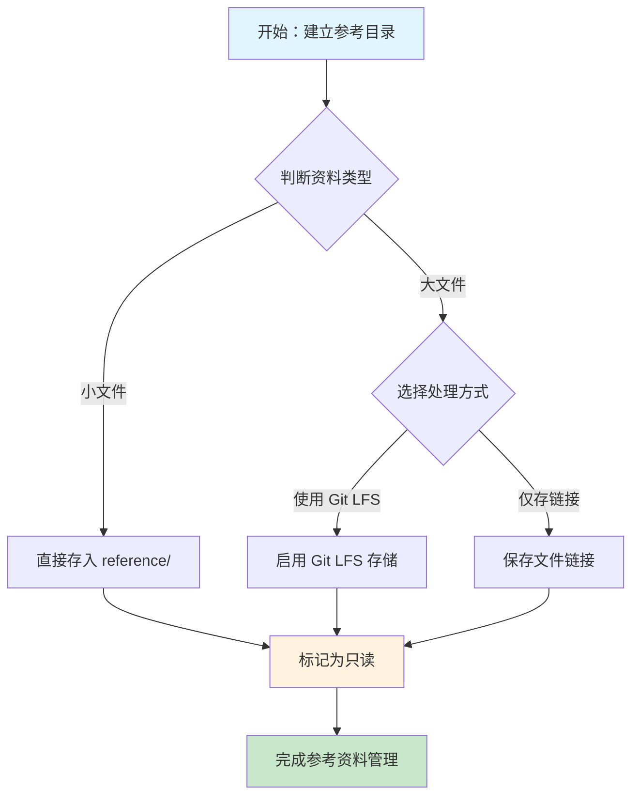

## 定义

只读参考资料管理是软件项目中一种系统化的资料组织方法，其核心特征是将外部参考资料以**只读**方式集中存储在与源码隔离的独立目录中。这种管理方式明确了"什么是项目产出物"与"什么是外部输入"之间的边界，是现代软件工程中知识管理的重要组成部分。

在具体实现上，只读参考资料管理通常包含以下要素：

- **独立的物理存储位置**：使用专用目录（如 `reference/`、`docs/reference/`、`external/` 等）存放所有参考资料
- **明确的只读属性**：目录及其内容标记为只读，防止意外修改
- **清晰的分类体系**：按照资料来源或类型进行合理分类
- **可追溯的来源标注**：每份资料应注明原始出处和引用理由

只读参考资料管理的本质是**关注点分离（Separation of Concerns）**原则在项目知识管理领域的具体应用。

## 解决什么问题

在软件项目开发过程中，团队通常需要参考大量外部材料：技术文档、开源实现、学术论文、行业标准等。如果这些资料与项目源码混置，将产生以下问题：

### 核心困难

**1. 结构混乱，难以维护**

当参考资料与源码混合存放时，项目的目录结构会变得臃肿且难以理解。新成员加入项目时，很难快速区分哪些是项目自身代码，哪些是参考资料。

**2. 版本控制负担加重**

大型参考资料（如 PDF 论文、图片、第三方库）如果直接纳入版本控制，会导致 Git 仓库体积膨胀，历史记录膨胀，影响 clone 和 fetch 的效率。

**3. 资料孤立，缺乏关联**

没有系统化管理，参考资料与源码模块之间缺乏显式关联，开发者难以追溯某项功能的参考来源。

**4. 更新管理困难**

参考资料可能随时间推移而过时或更新，缺少规范化管理机制会导致资料更新混乱或遗漏。

### 根本诉求

只读参考资料管理要解决的根本问题是：**如何在大型项目中高效组织和管理外部参考资料，使其既便于查阅，又不影响项目源码的结构清晰度和版本控制效率。**

## 工作原理

### 目录隔离机制

只读参考资料管理的核心原理是在文件系统的物理层面实现内容分离。

```
项目根目录/
├── src/                    # 项目源码（可读写）
├── reference/              # 参考资料目录（只读）
│   ├── papers/             # 论文资料
│   ├── open-source/        # 开源参考项目
│   ├── blogs/              # 技术博客
│   └── standards/          # 行业标准文档
├── docs/                   # 项目自身文档
├── tests/                  # 测试代码
└── README.md
```

### 只读属性强化

在类 Unix 系统中，可通过以下方式强化目录的只读属性：

```bash
# 设置目录为只读（仅管理员可修改）
chmod 555 reference/

# 或使用 Git 属性设置特定文件类型不纳入追踪
# 在 .gitattributes 中添加：
*.pdf filter=lfs
```

### 分层管理架构

只读参考资料管理通常遵循三层架构：

| 层级 | 名称 | 功能 | 特点 |
|------|------|------|------|
| 第一层 | 目录管理层 | 定义目录结构、命名规范 | 一次性设计 |
| 第二层 | 分类存储层 | 按资料类型/来源分类存储 | 持续维护 |
| 第三层 | 元数据层 | 记录来源、版本、关联模块 | 可选增强 |

### 关键约束

只读参考资料管理的关键约束条件包括：

1. **物理隔离**：参考资料与源码不在同一目录树下
2. **不可编辑**：目录内容标记为只读，防止直接修改
3. **有据可查**：每份资料有明确的来源和用途记录
4. **版本可控**：大文件通过 LFS 等机制单独管理

## 典型应用

### 应用场景一：技术调研项目

在启动一个新的技术方向（如分布式事务处理）时，团队需要：

1. 收集相关学术论文（如 Google Spanner、CockroachDB 相关论文）
2. 分析开源实现（如 dtm、Seata）
3. 整理技术博客和最佳实践

**管理方式**：

```
reference/
├── papers/
│   ├── spanner-2012.pdf
│   ├── cockroach-2014.pdf
│   └── seata-architecture.md
├── open-source/
│   ├── dtm/
│   │   └── README.md  # 指向外部仓库
│   └── seata/
│       └── README.md
└── blogs/
    ├── distributed-transaction-patterns.md
    └── saga-vs-xa.md
```

**优势**：
- 所有调研材料集中，便于团队成员快速了解背景
- 与项目源码分离，不影响项目构建
- 支持多人协作调研，分工整理不同资料

### 应用场景二：SOTA 对标分析

在研发新功能时，需要对标业界最佳实践（State of the Art）：

```
reference/
├── sota/
│   ├── feature-x/
│   │   ├── competitor-a/    # 竞品A的实现分析
│   │   ├── competitor-b/    # 竞品B的实现分析
│   │   └── benchmark-report.md
│   └── performance/
│       └── latency-comparison.md
└── analysis/
    └── gap-analysis.md      # 与SOTA的差距分析
```

## 与其他概念的对比

### vs 混合格式管理

| 维度 | 只读参考资料管理 | 混合格式管理 |
|------|-----------------|-------------|
| 目录结构 | 清晰隔离 | 混乱混合 |
| 维护成本 | 初期较高，后期稳定 | 初期低，后期混乱 |
| 协作效率 | 高，便于快速定位 | 低，需要额外搜索 |
| 版本控制 | 大文件单独处理 | 全量追踪，仓库膨胀 |

### vs Wiki 知识库

| 维度 | 只读参考资料管理 | Wiki 知识库 |
|------|-----------------|-------------|
| 资料形态 | 原始文件（PDF、代码） | 渲染后的文本 |
| 交互性 | 静态展示 | 可协作编辑 |
| 适用场景 | 技术资料存档 | 团队经验沉淀 |
| 更新频率 | 低频，版本稳定 | 高频，持续迭代 |

### vs 依赖包管理

| 维度 | 只读参考资料管理 | 依赖包管理 |
|------|-----------------|-------------|
| 管理对象 | 参考阅读材料 | 运行时依赖 |
| 版本控制 | 可选 | 必须 |
| 自动获取 | 手动维护 | 工具自动管理 |
| 使用方式 | 人工查阅 | 代码直接引用 |

## 常见误区

### 误区一：只读即不动

**错误理解**：认为"只读"意味着资料放进去就不用管了。

**正确做法**：只读资料库需要定期审查和更新，移除过时内容，补充新的有价值资料。

### 误区二：目录越大越好

**错误理解**：把所有能找到的相关资料都塞进去。

**正确做法**：只保留真正有参考价值的资料，避免信息噪音。推荐采用"精选"原则：宁缺毋滥。

### 误区三：忽略大文件问题

**错误理解**：直接提交大型 PDF、视频等到版本控制。

**正确做法**：使用 Git LFS 或只保留链接，避免仓库体积膨胀。

### 误区四：缺乏索引机制

**错误理解**：资料随便放，需要时再搜索。

**正确做法**：建立资料索引或目录清单，标注每份资料的关键词、适用范围和推荐程度。

## 关联知识

### 上级概念

只读参考资料管理本身即为基础概念，在项目知识管理领域没有更高级别的包含概念。

### 相关概念

- [[concept-reference-categorization]] - 参考材料分类：在只读参考资料管理框架下，按来源类型（开源项目、论文、博客）对资料进行细分存储的方法
- [[entity-reference-dir]] - reference/ 目录：实施只读参考资料管理的具体物理载体
- [[entity-git-lfs]] - Git LFS：处理只读参考资料中大文件的技术手段

### 扩展知识

- **知识图谱构建**：将参考资料与项目模块建立关联，形成可视化的知识网络
- **版本化管理**：对参考资料本身实施版本控制，记录资料的演进历史
- **自动化同步**：建立与外部资料源（如arXiv、GitHub）的自动同步机制

## 待探讨

### 实践层面的开放问题

1. **资料质量评估标准**：如何量化评估参考资料的价值，筛选出最核心的材料？

2. **过期资料处理策略**：当参考资料中的技术已经过时，是保留还是归档？

3. **访问权限分级**：是否需要根据资料敏感度设置不同的访问权限？

4. **自动化索引生成**：能否通过 AI 自动分析资料内容，生成关键词索引？

5. **跨项目资料共享**：多个项目之间如何共享只读资料库，避免重复存储？

### 理论层面的待研究问题

1. 只读参考资料管理在不同规模项目（个人/小团队/大型组织）中的最佳实践差异
2. 只读资料与可编辑知识库之间的最优平衡点
3. 资料引用追溯机制的自动化实现方案

## 来源

本概念页内容整理自 Clone 项目的 reference/ 目录规范说明[^1]，并结合软件工程中的项目知识管理最佳实践进行了扩展。

[^1]: Clone 项目 `reference/` 目录说明，src-reference-directory-spec


<div align="right" style="opacity: 0.5; font-size: 0.8em;">✨ <i>Compiled by MiniMax-M2.7-highspeed</i></div>


## 图示



> 只读参考资料管理流程图
